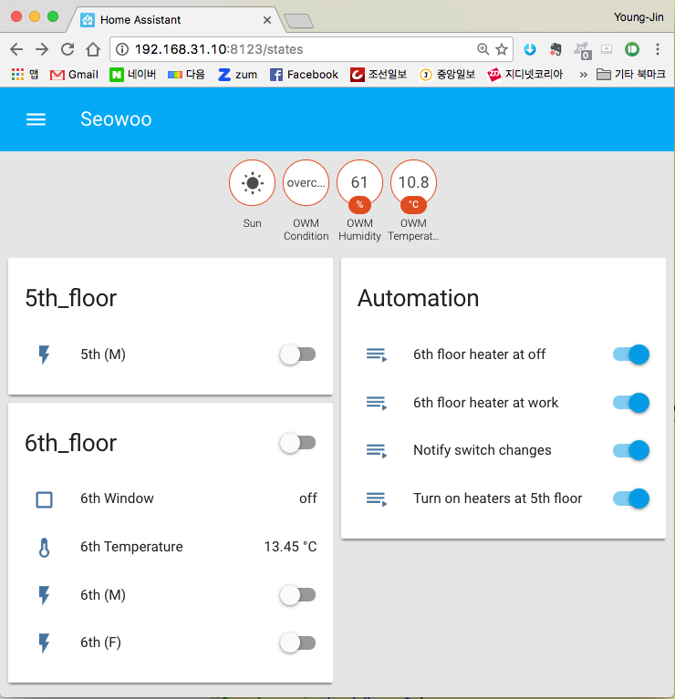

# Home-Assistant-Configuration

스마트 홈을 구현하기 위해 산 장치들과 스프트웨서 설정을
설정들을 정리한다.

## HUB 장치 및 프로토콜
초기에는Orvio WiFi 소켓으로전원만 간단히 전원만 제어하려
하였지만 무선랜이 음영 구간이 많고 또Orvibo 회사가
중국에 있기 때문인지 인터넷 연결이 잘 되지 않았다.
어러장치들을 살펴보고 최종으로는 다음 2가지 중 하나를
선택하기로 했다.

 * 삼성 SmartThings
 * Xiaomi smart home suite
 
두 제품 다 한국 전기 콘센트 맞지 않아 이왕이면 가격이 싼
xiaomi 제품을 구매했다.

## Home Sever
 * Raspberry Pi
 * Orange Pi
 * voyo v2/v3 - 리눅스가 설치되지 않는다.

## Xiaomi Aqara MQTT broker

## Wifi 재연결

